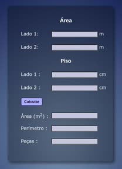

# TileCalc



TileCalc is a simple calculator designed to help users determine the number of tiles required to cover a given floor area. It takes inputs for the floor area in square meters and the dimensions of the tiles in centimeters, and then calculates and displays the number of tiles needed to cover the specified area. This tool is handy for anyone planning a tiling project and wanting to estimate the quantity of tiles required.

## Features

- Input area in square meters: Users can easily input the floor area they want to cover with tiles.
- Input tile dimensions: Users can specify the dimensions of the tiles they plan to use (length and width in centimeters).
- Calculate tile quantity: The calculator will efficiently compute the number of tiles needed to cover the given floor area.
- User-friendly interface: The application provides an intuitive and straightforward interface, making it accessible to all users.

## Technologies

- HTML
- CSS
- JavaScript

## Getting Started

To use TileCalc, follow these steps:

1. Clone the repository to your local machine using the following command:

```
git clone https://github.com/phcrepaldi/Tile-Calc.git
```

2. Open the `index.html` file in your preferred web browser.

3. Input the floor area in square meters and the dimensions of the tiles in centimeters.

4. Click the "Calculate" button to obtain the number of tiles required.

## Contributing

We welcome contributions to TileCalc! If you'd like to add new features, fix bugs, or enhance the project in any way, please feel free to fork the repository and create a new branch for your changes. Once you're ready, submit a pull request, and we'll review it as soon as possible.

## Links

- Project homepage: https://github.com/phcrepaldi/Tile-Calc
- Issue tracker: https://github.com/phcrepaldi/Tile-Calc/issues
  - For any sensitive or security-related issues, please contact us directly at your-email@example.com instead of using the issue tracker. Your cooperation in maintaining the project's security is highly appreciated.

## Licensing

The code in this project is licensed under the MIT license. See the [LICENSE](LICENSE) file for more details.

Thank you for using TileCalc! We hope it proves to be a helpful tool for your tiling projects. If you have any questions, feedback, or suggestions, feel free to reach out to us via GitHub or email. Happy tiling!